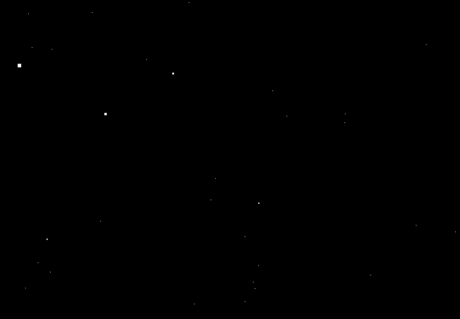

# It's summer break and I am bored

## So I decided to try new things on C

1. I made a rotating cube to test raylib library. 


2. I made starfield space simulation screen saver from Windows 95



## Compile & Run

I vibe coded a multi-platform(?) Makefile. Only tested on macOS.

Make sure Raylib package is installed.

Run the cube
```bash
# 1. To compile and run the spinning cube
make run_cube

# 2. To compile and run the starfield space simulation
make run_starfield

# 3. To compile everything at once
make all

# 4. To clean up all binary files and garbage left behind
make clean
```
